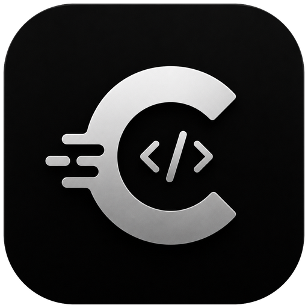

<p align="center">
  
</p>

# Codesu

**A desktop cockpit for running many Claude Code agents at once.**

Codesu wraps the [Claude Code](https://docs.anthropic.com/en/docs/claude-code) CLI in a native desktop app so you can spin up multiple agents across your projects, watch what each one is doing at a glance, and organize the work with a built-in kanban board, notes, and activity history — all backed by real terminals.

> **Status:** early release · **v0.1.0** · **License:** MIT

---

## Contents

- [Why Codesu?](#why-codesu)
- [Features](#features)
- [Tech stack](#tech-stack)
- [Download & install (macOS)](#download--install-macos) — *for users*
- [Using Codesu (first run)](#using-codesu-first-run)
- [Getting started (build from source)](#getting-started-build-from-source) — *for developers*
- [Keyboard shortcuts](#keyboard-shortcuts)
- [Project structure](#project-structure)
- [How it works](#how-it-works)
- [Your data & backups](#your-data--backups)
- [Troubleshooting](#troubleshooting)
- [Recommended IDE setup](#recommended-ide-setup)
- [Contributing](#contributing)
- [License](#license)

---

## Why Codesu?

Running Claude Code in a single terminal is fine for one task. But the moment you're juggling several agents — one refactoring the backend, one writing docs, one chasing a bug — plain terminal tabs stop scaling. You lose track of which agent is *working*, which is *waiting on you*, and which just *finished*.

Codesu solves that by:

- Giving every agent its own persistent, resumable terminal session.
- **Automatically detecting each agent's state** by reading Claude's own output — so blocked and finished agents float to the top and chime for your attention.
- Grouping agents into **color-coded workspaces** (folders or git worktrees).
- Layering **tasks, notes, and daily activity tracking** on top, so the surrounding project management lives in the same window.

---

## Features

### Agent management
- **Three agent kinds:** `Claude` (launches the `claude` CLI), `Shell` (a plain login shell), and `Command` (any custom program).
- **Persistent, resumable Claude sessions.** Each Claude agent is bound to a stable session id and relaunched with `--resume`, so closing and reopening the app brings the whole conversation back exactly where it left off.
- **Automatic activity states.** Codesu reads Claude's live TUI output (its "esc to interrupt" spinner and prompt markers) to derive each agent's state without any polling of the API:
  - 🔵 **Working** — actively producing output
  - 🔴 **Blocked** — quiet and waiting on your answer (a permission or question)
  - 🟢 **Done** — just finished a turn; output to review
  - ⚪ **Idle** — quiet, ready to continue
  - ⚫ **Exited** — the process has ended
- **Audio + visual cues.** A chime plays when an agent finishes or gets blocked, and the sidebar re-sorts so agents needing attention rise to the top.
- **Reopen last closed agent** and instant tab switching with `Cmd+1…9`.

### Workspaces & git worktrees
- Organize agents by project folder, each with an accent color.
- **Create git worktrees on the fly** (`<repo>/.worktrees/<branch>`) so parallel agents work on isolated branches without stepping on each other — created, listed, and removed straight from the app.
- **Open a workspace in your editor** (VS Code or IntelliJ IDEA) with one click.

### Tasks (kanban)
- A four-column board: **Backlog → In Progress → Testing → Done**, with drag-and-drop.
- **Spawn an agent from a task** — the task's title, details, and attached file paths are folded into an opening prompt so the agent starts working immediately.
- **File attachments** with inline image thumbnails.
- Completed tasks auto-archive; the archive stays searchable in History.

### Notes & ideas
- A Notes page for free-form, markdown-friendly ideas.
- **Fork an idea into one or more tasks** — capture a thought once, branch it into independent pieces of work later.

### Activity & history
- A **day-by-day journal** logging when you *worked* on or *completed* each agent and task (pruned to a rolling **120-day** window).
- A **Daily Report** and a **History** page to review past work, restore finished agents, and browse the task archive.

### Terminal
- Powered by **xterm.js** with the WebGL renderer for smooth, responsive output.
- A dedicated **system terminal** view alongside the per-agent terminals.
- The Rust backend coalesces PTY output into ~8ms / 64KB batches to stay fast under Claude's bursty, colored output.
- Agents are shut down gracefully (SIGTERM, then SIGKILL after a grace period) so Claude flushes and persists its session on exit.

### Customization
- **Fully rebindable keyboard shortcuts**, scoped per view.
- Resizable sidebar, workspace/agent split, and notes pane — all persisted.
- Mute toggle for state-change sounds.

---

## Tech stack

| Layer        | Technology                                                        |
|--------------|-------------------------------------------------------------------|
| **Frontend** | SvelteKit 2 · Svelte 5 (runes) · TypeScript · Vite 6              |
| **Terminal** | xterm.js v6 (`@xterm/xterm`, `addon-fit`, `addon-webgl`)          |
| **Desktop**  | Tauri 2                                                            |
| **Backend**  | Rust 2021 · `portable-pty` (PTY management) · `serde` / `serde_json` |
| **Plugins**  | `tauri-plugin-dialog` (file pickers) · `tauri-plugin-opener`      |

The frontend is a static SvelteKit build (`@sveltejs/adapter-static`) served inside the Tauri window. All heavy lifting — spawning PTYs, git worktree operations, editor launching, and state persistence — happens in Rust over Tauri's IPC.

---

## Download & install (macOS)

**Just want to use Codesu?** You don't need any of the developer tooling below —
grab the app and go.

**System requirements**
- **macOS 10.15 (Catalina) or newer**, Apple Silicon *or* Intel (the app is universal).
- The **Claude Code CLI** (the `claude` command) installed and on your `PATH` —
  Codesu launches it for you; it doesn't replace it. Get it from the
  [Claude Code docs](https://docs.anthropic.com/en/docs/claude-code).
- To use git worktrees or "open in editor": `git` and (optionally) VS Code / IntelliJ on your `PATH`.

### Steps
1. **Download** `Codesu_x.y.z_universal.dmg` and double-click it.
2. **Drag `Codesu`** into your **Applications** folder.
3. **Open it** (see the first-launch note below).

The app is **universal** — it runs natively on both Apple Silicon (M1–M4) and Intel Macs.

### ⚠️ First launch: "unidentified developer" / "damaged"
Current builds aren't signed with an Apple Developer certificate yet, so macOS
Gatekeeper blocks the **first** open. This is expected — trust it once and every
launch after is a normal double-click:

- **Right-click `Codesu` in Applications → Open → Open.** *(easiest)*
- If macOS instead says *"damaged"*, clear the download flag once:
  ```bash
  xattr -dr com.apple.quarantine /Applications/Codesu.app
  ```
  Or just double-click the bundled **`Open Codesu (first time).command`** helper,
  which does this for you — no Terminal required.

Full step-by-step (to share with others): **[INSTALL.md](INSTALL.md)**.

---

## Using Codesu (first run)

1. **Create a workspace** — point it at a project folder (each gets an accent color).
2. **Add a Claude agent** (`Cmd+T`) — it opens a real terminal running `claude` in
   that folder. Type your prompt and work exactly as you would in a terminal.
3. **Watch the sidebar** — agents that are 🔵 working, 🔴 blocked (waiting on you),
   or 🟢 done re-sort automatically and chime, so you always know who needs attention.
4. **Organize the work** — capture **Tasks** on the kanban board (spawn an agent
   straight from a task), jot **Notes**, and review your **Daily Report** / **History**.

Your data (workspaces, agents, tasks, notes, history) is saved automatically to
`~/Library/Application Support/codesu/` and **survives app upgrades and reinstalls**.
See [FEATURES.md](FEATURES.md) and [QUICKSTART.md](QUICKSTART.md) for the full tour.

---

## Getting started (build from source)

Only needed if you want to develop Codesu or build it yourself.

### Prerequisites
- **Node.js 18+** and **pnpm**
- **Rust** (stable) and the [Tauri 2 system prerequisites](https://tauri.app/start/prerequisites/) for your OS
- The **Claude Code CLI** (`claude`) on your `PATH` — this is what Codesu's Claude agents run

### Run in development
```bash
git clone https://github.com/kmlcnclk/codesu.git
cd codesu

pnpm install
pnpm tauri dev      # launches the desktop app with hot reload
```

### Build a desktop app
```bash
pnpm tauri build    # native bundle for the current architecture

# Universal macOS build (runs on both Apple Silicon and Intel).
# Requires the rustup toolchain with both targets:
#   rustup target add aarch64-apple-darwin x86_64-apple-darwin
pnpm tauri build --target universal-apple-darwin
```
The `.app` and `.dmg` land in
`src-tauri/target/universal-apple-darwin/release/bundle/`. See
**[INSTALL.md](INSTALL.md)** for the end-user install steps (including the
first-launch Gatekeeper note for the current unsigned builds).

### Handy scripts
| Command             | What it does                              |
|---------------------|-------------------------------------------|
| `pnpm dev`          | Vite dev server (frontend only)           |
| `pnpm build`        | Build the SvelteKit frontend              |
| `pnpm preview`      | Preview the production frontend build     |
| `pnpm check`        | Type-check with `svelte-check`            |
| `pnpm tauri dev`    | Run the full desktop app in dev mode      |
| `pnpm tauri build`  | Build the distributable desktop app       |

---

## Keyboard shortcuts

All defaults use **Cmd** (`⌘`) on macOS. Every shortcut is rebindable in **Settings → Shortcuts**.

**Navigation**

| Shortcut       | Action        |
|----------------|---------------|
| `Cmd+A`        | Agents        |
| `Cmd+Y`        | Tasks         |
| `Cmd+N`        | Notes         |
| `Cmd+R`        | Daily Report  |
| `Cmd+H`        | History       |
| `Cmd+S`        | Settings      |
| `Cmd+Shift+T`  | Toggle Terminal |

**Agents view**

| Shortcut        | Action                     |
|-----------------|----------------------------|
| `Cmd+T`         | New Claude agent           |
| `Cmd+1…9`       | Switch to agent tab 1–9    |
| `Cmd+Delete`    | Close current agent        |
| `Cmd+Shift+Z`   | Reopen last closed agent   |

Within the **Tasks** and **Notes** views, `Cmd+1/2/3` switch between the board/list/archive (or active/archive) views.

---

## Project structure

```
codesu/
├── src/                              # SvelteKit frontend
│   ├── lib/
│   │   ├── components/               # UI: Sidebar, TabBar, TerminalArea,
│   │   │                             #     TasksPage, NotesPage, DailyReport,
│   │   │                             #     HistoryPage, SettingsPage, dialogs…
│   │   ├── store/app.svelte.ts       # Central reactive state + activity monitor
│   │   ├── terminal/createTerminal.ts# xterm.js wiring
│   │   ├── markdown.ts               # Markdown rendering
│   │   └── sound.ts                  # State-change chimes
│   ├── routes/                       # +page.svelte (app shell), layouts
│   └── app.css                       # Global dark theme
├── src-tauri/                        # Rust backend
│   ├── src/
│   │   ├── lib.rs                    # Tauri command handlers (IPC surface)
│   │   ├── pty.rs                    # PTY sessions + output coalescing
│   │   ├── git.rs                    # Git worktree create/list/remove
│   │   ├── editor.rs                 # Open folder in VS Code / IntelliJ
│   │   └── store.rs                  # JSON state persistence
│   └── tauri.conf.json
├── static/                           # Icons & static assets
└── package.json
```

The heart of the frontend is [`src/lib/store/app.svelte.ts`](src/lib/store/app.svelte.ts) — a single `AppState` class (Svelte 5 runes) that owns all workspaces, agents, tasks, and the activity journal, and runs the low-frequency monitor that derives agent states from terminal output.

---

## How it works

**Agent state detection.** Codesu never queries the Claude API for status. Instead, the frontend feeds every chunk of (ANSI-stripped) PTY output into an activity monitor. A ~200ms ticker inspects the tail of each Claude agent's output:
- Claude's live spinner (`esc to interrupt`) means **working**.
- When the spinner goes stale and a prompt marker (`Do you want to…`, `(y/n)`, a selection menu…) is present, the agent is **blocked**.
- When the spinner goes stale with no prompt, the turn is **done**.

This makes state detection resilient to the CLI evolving — the heuristics are simple, tunable arrays in one file.

**Session persistence.** Each Claude agent gets a UUID session id. Its terminal launches `claude --session-id <id>` the first time and `claude --resume <id>` thereafter (with an automatic fallback so it self-corrects either way). Codesu checks `~/.claude/projects/**/<id>.jsonl` to know which path to take.

**State storage.** The entire app tree (workspaces, agents, tasks, notes, activity log, layout, shortcuts) is serialized to a single JSON file. Terminals are runtime-only — they respawn lazily when a tab is opened. See [Your data & backups](#your-data--backups) for the full durability story.

---

## Your data & backups

Everything you create in Codesu — workspaces, agents, tasks, notes, activity
history, layout, and shortcuts — lives in **one JSON file** in your OS data
directory, **separate from the app itself**:

| OS | Location |
|----|----------|
| **macOS** | `~/Library/Application Support/codesu/state.json` |
| **Linux** | `~/.local/share/codesu/state.json` |
| **Windows** | `%APPDATA%\codesu\state.json` |

Because it lives outside the app bundle, your data **survives app upgrades and
even delete-and-reinstall**. (Claude's own conversations live under
`~/.claude/`, and git worktrees live in your repos — both are likewise
untouched by updating Codesu.)

**How it's protected:**
- **Atomic writes.** State is written to a temp file, flushed to disk (`fsync`),
  then atomically renamed into place — a crash or power loss can never leave a
  half-written `state.json`.
- **Rotating backup.** The previous good copy is kept as `state.json.bak` on
  every save.
- **Corruption recovery.** If `state.json` is ever unreadable, Codesu restores
  from `state.json.bak`. If neither is readable, the bad file is preserved as
  `state.corrupt.json` (never silently overwritten) so it can be recovered by hand.
- **Automatic migration.** Data from older builds (which stored under the
  `com.kmlcnclk.codesu/` folder) is migrated into `codesu/` on first launch.

**Restoring a backup manually.** Quit Codesu, then in the data folder copy
`state.json.bak` over `state.json` (or rename a `state.corrupt.json` back) and
relaunch.

**Making your own backup.** Copy the whole `codesu/` folder somewhere safe. This
is the only thing that also survives a *dedicated uninstaller* wiping the app's
data directory.

---

## Troubleshooting

**"Codesu can't be opened" / "unidentified developer" / "damaged."**
Expected for the current unsigned builds — see the first-launch note under
[Download & install](#download--install-macos) (or [INSTALL.md](INSTALL.md)).
Right-click → **Open** once, or run
`xattr -dr com.apple.quarantine /Applications/Codesu.app`.

**A Claude agent's terminal shows `command not found: claude`.**
The Claude Code CLI isn't on your `PATH`. Install it (see
[System requirements](#download--install-macos)) and confirm `which claude`
works in a normal terminal, then relaunch Codesu.

**My workspaces/agents are gone / the app opened empty.**
Your data is almost certainly safe on disk. Quit Codesu and check the
[data folder](#your-data--backups) — if `state.json` looks empty but
`state.json.bak` (or an older backup) is larger, copy the backup over
`state.json` and relaunch.

**Empty gap in the title bar, or duplicate window buttons.**
Fixed in current builds. If you built from source, make sure you're on the
latest and rebuilt (`pnpm tauri build`).

**A Claude session didn't resume where it left off.**
Codesu resumes by the session id stored per agent; if `~/.claude/projects/`
was cleared, that history is gone at the Claude CLI level (independent of Codesu).

---

## Recommended IDE setup

- [VS Code](https://code.visualstudio.com/) with:
  - [Svelte for VS Code](https://marketplace.visualstudio.com/items?itemName=svelte.svelte-vscode)
  - [Tauri](https://marketplace.visualstudio.com/items?itemName=tauri-apps.tauri-vscode)
  - [rust-analyzer](https://marketplace.visualstudio.com/items?itemName=rust-lang.rust-analyzer)

---

## Contributing

Contributions, bug reports, and feature requests are welcome. See [CONTRIBUTING.md](CONTRIBUTING.md) for how to get set up and the conventions this project follows.

---

## License

[MIT](LICENSE) — free to use, modify, and distribute for personal and commercial projects.

---

*Orchestrate your agents. Amplify your code.*
